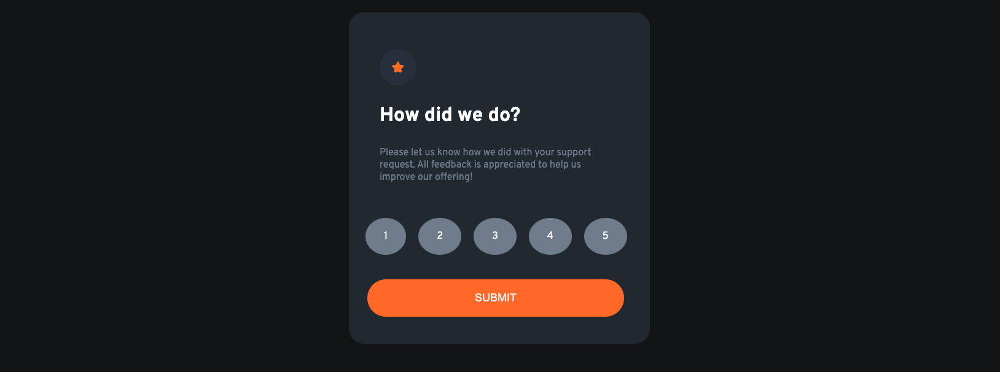

# Interactive rating component solution

This is my solution to the [Interactive rating component challenge on Frontend Mentor](https://www.frontendmentor.io/challenges/interactive-rating-component-koxpeBUmI). Frontend Mentor challenges help you improve your coding skills by building realistic projects. 

## Table of contents

- [Overview](#overview)
  - [The challenge](#the-challenge)
  - [Screenshot](#screenshot)
  - [Links](#links)
- [My process](#my-process)
  - [Built with](#built-with)
  - [What I learned](#what-i-learned)
  - [Continued development](#continued-development)
  - [Useful resources](#useful-resources)
- [Author](#author)
- [Acknowledgments](#acknowledgments)


## Overview
    This is a rating component that allows users to rate a product from 1 to 5 stars.

### The challenge

Users should be able to:

- View the optimal layout for the app depending on their device's screen size
- See hover states for all interactive elements on the page
- Select and submit a number rating
- See the "Thank you" card state after submitting a rating

### Screenshot



### Links

- Solution URL: [Add solution URL here](https://github.com/UbaidRussell/Interactive-rating-component)
- Live Site URL: [Add live site URL here](https://your-live-site-url.com)

## My process

### Built with

- Semantic HTML5 markup
- CSS custom properties
- JavaScript
- Flexbox
- Mobile-first workflow


### What I learned
On this project we learned a lot of DOM manipulation. We learned how to select elements, change their values, and hide and show them. We also learned how to use the preventDefault() method to prevent the default behavior of the form. this is the code we used to do all of that:

```js
let form = document.querySelector('form');
let mainContainer = document.getElementsByClassName('main-container');
let radioChoices = document.querySelectorAll('input[type="radio"]');
let radioChoice; 
let userAnswer = document.getElementById('user-answer');
let secondaryContainer = document.getElementsByClassName('secondary-container');

console.log(radioChoices);
hideSecondaryContainer();
window.alert('Just like that, we got it done 🥂')


//Runs when the form is submitted
form.onsubmit = function(e){
    e.preventDefault();
    radioChoice = document.querySelector('input[type="radio"]:checked');
    console.log(radioChoice.value);
    changeNumber();
    hideMainContainer();
    showSecondaryContainer();
}

//Change the number in the secondary container
function changeNumber (){
    userAnswer.innerHTML = radioChoice.value;
}

//Hide the main container
function hideMainContainer(){
    mainContainer[0].style.display = 'none';
}
//Show the main container
function showMainContainer(){
    mainContainer[0].style.display = 'block';
}

//Hide the secondary container
function hideSecondaryContainer(){
    secondaryContainer[0].style.display = 'none';
}
//Show the secondary container
function showSecondaryContainer(){
    secondaryContainer[0].style.display = 'block';
}
```

### Continued development

We will continue working on this site by making it more responsive and adding more features to it. We will also try to make it more accessible by adding aria labels and other accessibility features.

### Useful resources

- [Example resource 1](https://stackoverflow.com/questions/29311918/how-do-i-capture-data-entered-into-the-field-of-an-html-form) - This is an amazing article which helped me finally understand how to capture data entered into the field of an HTML form. I'd recommend it to anyone still learning this concept.

- [Example resource 2](https://developer.mozilla.org/en-US/docs/Web/CSS/:checked) - This is an amazing article which helped me finally understand how to use the :checked pseudo class to work on my radio buttons. I'd recommend it to anyone still learning this concept.

## Author

- Website - [UbaidRussel](https://ubaidrussell.com/)
- Frontend Mentor - [@UbaidRussell](https://www.frontendmentor.io/profile/UbaidRussell)
- Twitter - [@UbaidRussell](https://www.twitter.com/UbaidRussell)

## Acknowledgments

Shoutout to the Frontend Mentor community for being so supportive and helpful.